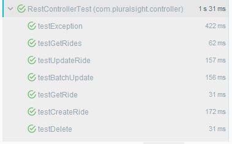
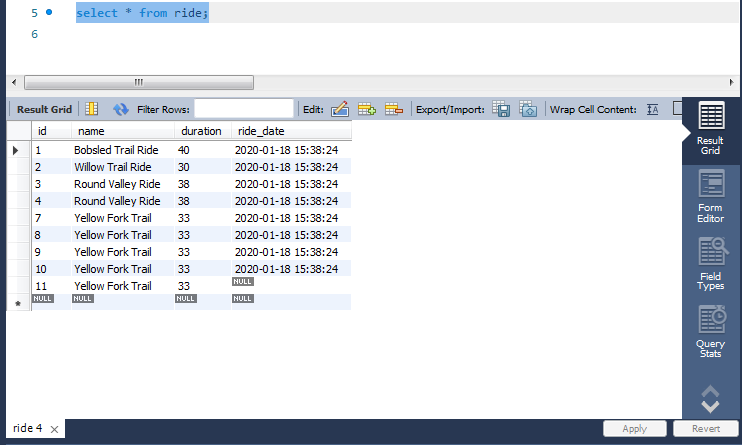
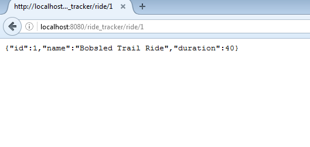
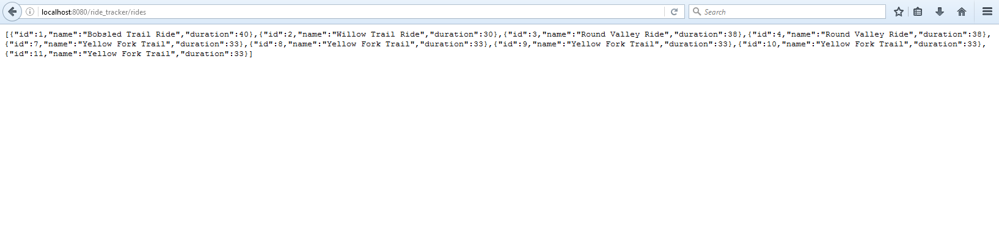
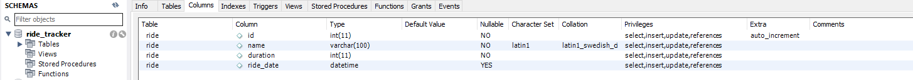

Requirements to run:
- Java 1.8
- Maven 3+
- Tomcat: v8.5.46
- MySQL:
    - MySQL Server v5.7.28
    - MySQL Workbench v8.0.18
    - ConnectorJ v8.0.18

This project was created by following the "Building Applications Using Spring JDBC" course on PluralSight.

**Functionality:**

This project allows you to create, read, update and delete entries in a list of mountain bike rides to track
which ones you have done, the duration each took and the dates you did them.

**Technical Info:**

The project uses Java (specifically Spring Framework, Spring MVC and Spring JDBC), interacting with a MySQL database for backend and JSP/HTML for frontend. It follows a Model, Service, Repository tier architecture. Maven is used for dependency management and Tomcat is used as the application server.

The backend consists of a REST API to interact with the MySQL database in order to have CRUD functionality. The frontend for this project is very simple and just serves to display the data and reach the different endpoints. The project uses GET, POST, PUT and DELETE calls to do Create, 
Read, Update and Delete functions respectively. The project also showcases some advanced features such as Batch Updates, handling database exceptions and rolling back data through Transactions.

The project uses JUnit test cases to simulate the functionality of the above.

**Screenshots:**

Running the JUnit tests to populate the database and simulate functionality:

After running the above test cases a number of times with various test data, the MySQL database will be populated as such:

Example of Get Ride functionality reading from the first entry/id in the database and displaying it in JSON format:

Example of Get Rides functionality reading from all the entries in the database and displaying them in JSON format:

Before you can run the project properly, you must first setup the database schema and table as follows:
